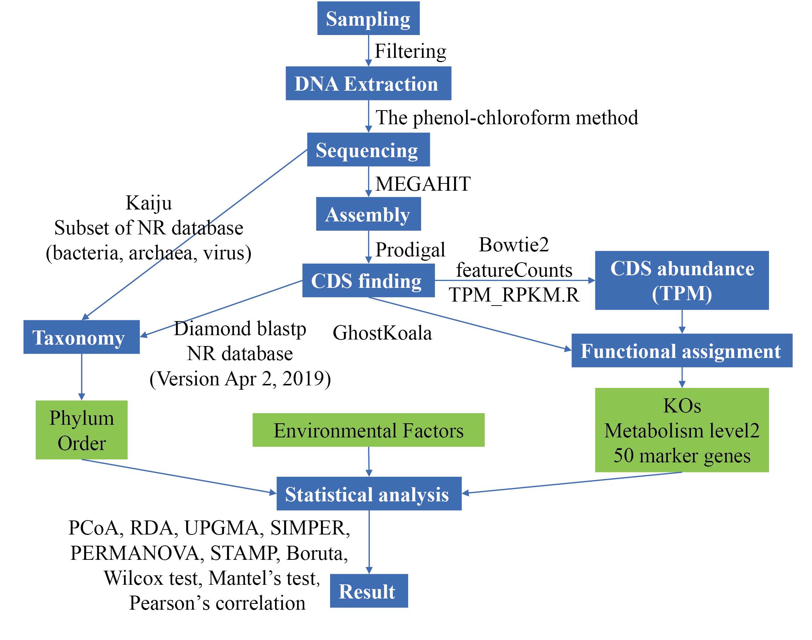

# The Analysis Pipeline to Metagenome of Planktonic Microbiota in Lakes at Different Trophic Levels

> The pipeline is developed by  by Mengyuan Shen ([mengyuanshen@126.com](mailto:mengyuanshen@126.com)). For questions and comments, please contact mengyuan or submit an issue on github.




### 1 Building work environment

#### 1.1 The software need to install

- `bowtie2`
- `diamond-v0.9.24`
- `prodigal-2.6.3`
- `samtools-1.4.1`
- `megan6`
- `kaiju`

#### 1.2 Database

```shell
## nr
axel ftp://ftp.ncbi.nlm.nih.gov/blast/db/FASTA/nr.gz
axel ftp://ftp.ncbi.nlm.nih.gov/blast/db/FASTA/nr.gz.md5
# https://github.com/bbuchfink/diamond
# diamond makedb --in nr.faa -d nr

## MEGAN6 database
axel http://ab.inf.uni-tuebingen.de/data/software/megan6/download/prot_acc2tax-Mar2018X1.abin.zip

## kaiju database
# Non-redundant protein database nr
makeDB.sh -n 
```
### 2 Co-assembly

```shell
megahit=~/biosoft/megahit_v1.1.1_LINUX_CPUONLY_x86_64-bin/megahit
$megahit -1 DC_R1.fq.gz,DC-1_R1.fq.gz \
		 -2 DC_R2.fq.gz,DC-1_R2.fq.gz \
         --presets meta-large -o DC_MEGAHIT_two_years -t 15 --out-prefix DCL --min-contig-len 500 \
         --continue
```
### 3 CDS finding
```shell
# $ ~/biosoft/prodigal.linux -v
# Prodigal V2.6.3: February, 2016
lake=DCL
name=D
prodigal=~/biosoft/prodigal.linux
anvi_script_reformat_fasta=~/anaconda3/envs/anvio_5.2.0/bin/anvi-script-reformat-fasta
contig=~/WORK/Yun_Gui_Lake/assembly/${lake}_MEGAHIT_two_years/${lake}.contigs.fa
$anvi_script_reformat_fasta $contig -o ${name}_contig.fa --simplify-names --prefix ${name}
$prodigal -a ${name}_gene.faa -d ${name}_gene.fna -f gff -o ${name}_gene.gff -p meta -i ${name}_contig.fa
```
### 4 CDS abundance 
- mapping
```shell
## Software
bowtie2_build=~/biosoft/bowtie2-2.3.4.1-linux-x86_64/bowtie2-build
bowtie2=~/biosoft/bowtie2-2.3.4.1-linux-x86_64/bowtie2
samtools=~/anaconda3/envs/anvio_5.2.0/bin/samtools
NUM_THREADS=25
## Data
name=D
contig=~/WORK/Yun_Gui_Lake/co_gene_count_20190401/${name}_contig.fa
data1=~/WORK/Yun_Gui_Lake/Yun_Gui_Lake_2017/Clean_Data
data2=~/WORK/Yun_Gui_Lake/Yun_Gui_Lake_2018/Data
R1_1=$data1/DCL-1_R1.fq.gz
R1_2=$data1/DCL-1_R2.fq.gz
R2_1=$data2/DCL-2_R1.fq.gz
R2_2=$data2/DCL-2_R2.fq.gz

# Run
#$bowtie2_build $contig $contig
$bowtie2 --threads $NUM_THREADS -x $contig -1 $R1_1 -2 $R1_2 | $samtools view -@ 25 -Sb - |$samtools sort -@ 25 - >${name}_17_s.bam
$samtools index ${name}_17_s.bam

java -Xms500g -Xmx500g -XX:ParallelGCThreads=25 \
-XX:MaxPermSize=500g -XX:+CMSClassUnloadingEnabled \
-jar ~/biosoft/picard.jar MarkDuplicates \
INPUT=${name}_17_s.bam \
OUTPUT=${name}_17_smd.bam \
METRICS_FILE=${name}_17-smd.metrics \
AS=TRUE \
VALIDATION_STRINGENCY=LENIENT \
MAX_FILE_HANDLES_FOR_READ_ENDS_MAP=1000 \
REMOVE_DUPLICATES=TRUE
```

- count

```shell
name=D
~/biosoft/subread-1.6.4-Linux-x86_64/bin/featureCounts -T 25 -F gff -p -t CDS -g ID -a ${name}_gene.gff -o  ${name}_gene_counts_name.txt ${name}*.bam
Rscript TPM_RPKM.R ${name}_gene_counts_name.txt
```

- NR annotion
```shell
diamond=~/biosoft/Diamond/diamond
nr=~/DATAbase/NR/nr
blast2lca=~/biosoft/MEGAN_6_15_1/megan/tools/blast2lca
NUM_THREADS=50
$diamond blastp -p $NUM_THREADS -d $nr -o ${name}_gene_nr.daa -q ${name}_gene.faa -f 100 -e 0.00001 --sensitive --top 3
```

### 5 Taxonomic Analysis

```shell
nodes=~/biosoft/kaiju/bin/kaijudb/nodes.dmp
names=~/biosoft/kaiju/bin/kaijudb/names.dmp
kaiju_db=~/biosoft/kaiju/bin/kaijudb/kaiju_db_nr.fmi
data1=~/Ten_lake_new/Clean_Data

do
kaiju -t $nodes -f $kaiju_db -i $data1/DCL-1_R1.fq.gz -j $data1/DCL-2_R2.fq.gz -o
DCL-1_nr_kaiju.out -z 25 -E 0.05
kaiju2krona -t $nodes -n $names -i DCL-1_nr_kaiju.out -o DCL-1_nr_kaiju2krona.out
for j in phylum class order
do(kaijuReport -t $nodes -n $names -i DCL-1_nr_kaiju.out -r ${j} -o
DCL-1_nr_${j}_kaiju.out.summary -u -p)
done
```

### 6 Functional Analysis
```shell
seqkit split2 -p 6 D_gene.faa
# Upload the split file to https://www.kegg.jp/ghostkoala/
```

### 7 Figures  scripts

- Figure 1. Structure and composition of the microbial communities along with the different trophic types. ([Data:kaiju_all_lake_phylum_count.txt](https://raw.githubusercontent.com/shenmengyuan/Yun-Gui_plateau_lake/master/Datasets/kaiju_all_lake_phylum_count.txt),[Scripts](https://raw.githubusercontent.com/shenmengyuan/Yun-Gui_plateau_lake/master/Scripts/Figure_1.R))
- Figure 2. Metabolism function and composition of the microbial communities along with the different habitat types ([Data1:gene_TPM_name_filter_190506.csv](https://raw.githubusercontent.com/shenmengyuan/Yun-Gui_plateau_lake/master/Datasets/gene_TPM_name_filter_190506.csv),[Data2:gene.anno.txt](https://raw.githubusercontent.com/shenmengyuan/Yun-Gui_plateau_lake/master/Datasets/gene.anno.txt),[Data3:group.txt](https://raw.githubusercontent.com/shenmengyuan/Yun-Gui_plateau_lake/master/Datasets/group.txt),[Scripts](https://raw.githubusercontent.com/shenmengyuan/Yun-Gui_plateau_lake/master/Scripts/Figure_2.R))
- Figure 3. Environmental drivers of microbial community composition.  ([Data:kaiju_all_lake_phylum_count.txt](https://raw.githubusercontent.com/shenmengyuan/Yun-Gui_plateau_lake/master/Datasets/kaiju_all_lake_phylum_count.txt),[Data2:env.txt](https://raw.githubusercontent.com/shenmengyuan/Yun-Gui_plateau_lake/master/Datasets/env.txt), ,[Scripts](https://raw.githubusercontent.com/shenmengyuan/Yun-Gui_plateau_lake/master/Scripts/Figure_3.R))

### Cite

Shen M, Li Q, Ren M, Lin Y, Wang J, Chen L, Li T and Zhao J. (2019) Trophic Status is Associated withCommunity Structure and Metabolic Potential of Planktonic Microbiota in Plateau Lakes. Front.Microbiol. 10:2560. doi:10.3389/fmicb.2019.02560

